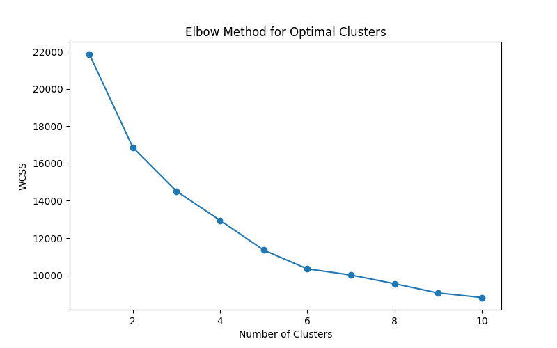
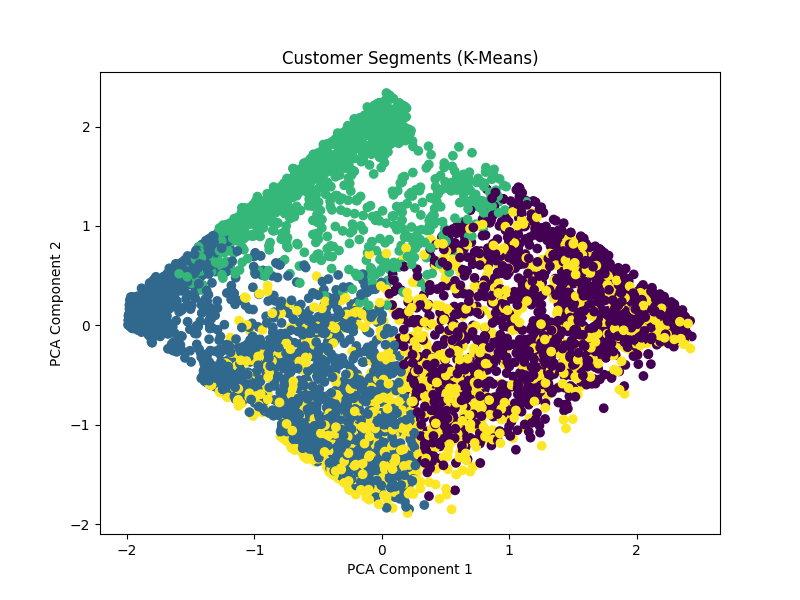

# Clustering Analysis – Stage 2 (2-2)

## Project: Telecom Customer Churn Analysis

## 1. Overview
This stage focuses on performing **clustering analysis** to identify distinct customer segments within the telecom dataset.  
Clustering is an **unsupervised machine learning technique** that groups customers based on similarity in their usage and service-related features.

All clustering deliverables are stored in the **Clustering_Analysis** folder as required by the assessment instructions.

---

## 2. Clustering Analysis Deliverables

The following files were created as part of Stage 2 (2-2):

- **01_elbow_method.png** – Elbow Method graph used to determine the optimal number of clusters  
- **02_kmeans_model.pkl** – Trained K-Means clustering model  
- **03_cluster_visualization.png** – Visual representation of customer clusters  
- **04_clustered_dataset.csv** – Dataset containing assigned cluster labels  

---

## 3. Optimal Number of Clusters

### 3.1 What is the Optimal Number of Clusters?
The **optimal number of clusters** refers to the value of *K* that best balances:
- Minimising variation within each cluster
- Avoiding unnecessary complexity from too many clusters

Selecting the correct number of clusters ensures the results are **meaningful, interpretable, and useful** for business analysis.

---

### 3.2 Elbow Method
The **Elbow Method** was used to determine the optimal number of clusters.

This method works by:
1. Training K-Means models with different values of *K*
2. Calculating the **Within-Cluster Sum of Squares (WCSS)** for each value
3. Plotting WCSS against the number of clusters

The optimal number of clusters is identified at the point where the curve begins to flatten, forming an “elbow”.

**Figure 1 below shows the Elbow Method result used in this analysis.**

Based on the graph, the elbow point indicates the most suitable number of clusters for the dataset.

---

## 4. K-Means Clustering Model

Using the optimal number of clusters identified from the Elbow Method, a **K-Means clustering model** was trained on the processed telecom dataset.

Key points:
- The model was trained using scaled numerical features
- Churn labels were not used, as clustering is unsupervised

The trained model was saved as a binary file:

- **02_kmeans_model.pkl**

This file stores the trained model and is not readable in a text editor, which is expected behaviour for machine learning models.

---

## 5. Cluster Visualisation and Labelling

### 5.1 Cluster Visualisation
To visually interpret the clustering results, **Principal Component Analysis (PCA)** was applied to reduce the dataset to two dimensions.

The resulting visualisation shows how customers are grouped into different clusters based on similarity.

**Figure 2 below displays the cluster visualisation.**

Each colour represents a different customer cluster.

---

### 5.2 Clustered Dataset
The final output of the clustering process is the clustered dataset:

- **04_clustered_dataset.csv**

This file contains the processed dataset with an additional column representing the **cluster label** assigned to each customer.

---

## 6. Business Insights
The clustering results indicate that customers can be grouped into **distinct segments** with different behaviour and usage patterns.

These segments can be used to:
- Identify high-risk churn groups
- Design targeted retention strategies
- Support personalised marketing and service offerings

---

## 7. Conclusion
This clustering analysis successfully completes **Stage 2 (2-2)** by:
- Identifying the optimal number of clusters using the Elbow Method
- Training and saving a K-Means clustering model
- Visualising and labelling customer clusters
- Producing a clustered dataset for future analysis

All deliverables have been implemented and documented according to ACS assessment guidelines.
