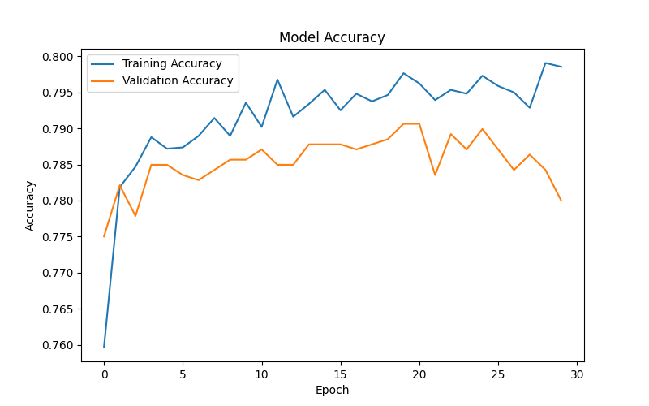
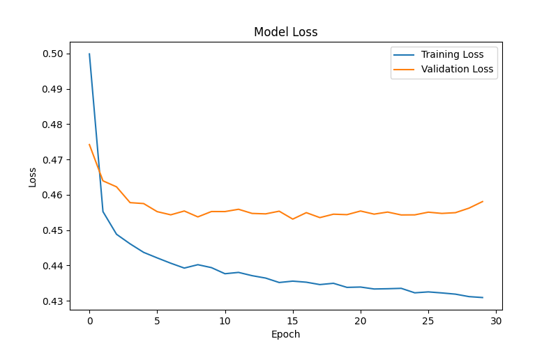
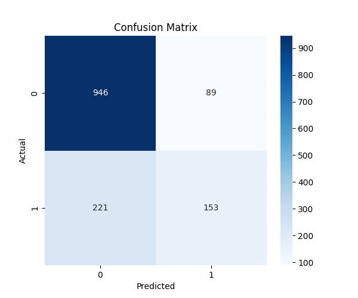

# Predictive Modeling – Customer Churn Prediction (ANN)

This section of the project focuses on predicting telecom customer churn using an Artificial Neural Network (ANN).

The model was trained using the processed dataset created during the Data Preparation stage and evaluated using several performance metrics.

---

## ANN Model Architecture

The Artificial Neural Network model contains:

- Input Layer (customer features)
- Hidden Layer 1 with ReLU activation
- Hidden Layer 2 with ReLU activation
- Output Layer with Sigmoid activation for binary classification

The model uses the Adam optimizer and binary cross-entropy loss function.

---

## Model Performance

The trained ANN model achieved an approximate accuracy of:

Accuracy: ~78%

---

## Model Evaluation

### Accuracy Graph

### Loss Graph

### Confusion Matrix

---

## Files in this Folder

01_ann_churn_prediction.ipynb  
Jupyter Notebook containing the complete ANN implementation including model training, evaluation, and visualizations.

churn_ann_model.h5  
Saved trained ANN model that can be reused for predictions.

confusion_matrix.png  
Visualization showing the performance of the churn prediction model.

accuracy_graph.png  
Graph showing training and validation accuracy during model training.

loss_graph.png  
Graph showing training and validation loss during model training.

---

## Project

Telecom Customer Churn Analysis  
Machine Learning & Data Analytics Project